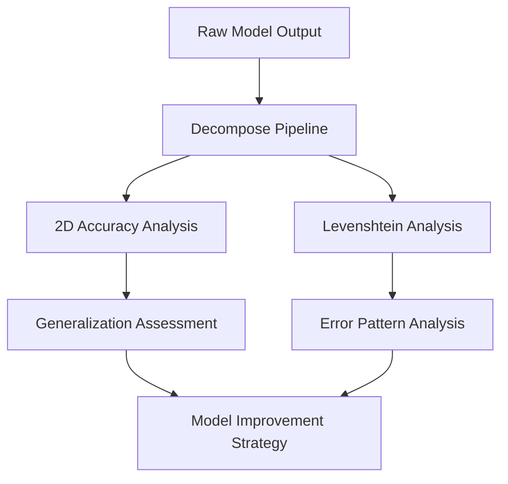

# Syriac Morphological Analysis - Data Processing Tools

## 🎯 Overview

Comprehensive suite of data processing and analysis tools for the Syriac morphological analysis project. This toolkit provides **complete pipeline processing**, **multi-level accuracy analysis**, and **detailed error evaluation** for neural network-based morphological analysis models.

## 🔄 Complete Processing Workflow

```
📊 Raw Model Output
        ↓
    🔧 Decompose Pipeline (Format Standardization)
        ↓
    📈 Accuracy Analysis (2D Matrix Evaluation)
        ↓
    🔍 Levenshtein Analysis (Unit-Level Evaluation)
        ↓
    📋 Comprehensive Performance Report
```

## 📁 Tool Suite Components

```
data_processing_tools/
├── decompose/                    # 🔧 Core data processing pipeline
│   ├── 01_out_original_reducer.py
│   ├── 02_generate_patterns_csv_from_reduced.py
│   ├── 03_convert_reduced_to_final.py
│   ├── 04_convert_final_to_out.py
│   ├── patterns.csv
│   └── README.md
├── accuracy_analysis_system/     # 📈 2D accuracy matrix analysis
│   ├── accuracy_analyzer.py
│   ├── z_score_analysis.py
│   ├── reverse_accuracy_calc.py
│   ├── reverse_z_score.py
│   └── README.md
├── levenshtein/                 # 🔍 Unit-level distance analysis
│   ├── compare_final_units.py
│   ├── unit_accuracy_report.json
│   └── README.md
└── README.md                    # This overview documentation
```

## 🚀 Quick Start Guide

### Complete Analysis Pipeline

```bash
# 1. Navigate to tools directory
cd data_processing_tools/

# 2. Run decompose pipeline (format standardization)
cd decompose/
python 01_out_original_reducer.py     # Reduce symbol pairs
python 02_generate_patterns_csv_from_reduced.py  # Extract patterns
python 03_convert_reduced_to_final.py  # Convert to numerical
python 04_convert_final_to_out.py      # Generate standard output

# 3. Run 2D accuracy analysis
cd ../accuracy_analysis_system/
python accuracy_analyzer.py --enhanced

# 4. Run unit-level analysis
cd ../levenshtein/
python compare_final_units.py --detailed

# 5. Review all generated reports
ls -la */*.txt */*.json
```

### Individual Tool Usage

#### Decompose Pipeline Only
```bash
cd decompose/
python 01_out_original_reducer.py
python 03_convert_reduced_to_final.py
```

#### Accuracy Analysis Only
```bash
cd accuracy_analysis_system/
python accuracy_analyzer.py --enhanced --data-dir ../../data/
```

#### Levenshtein Analysis Only
```bash
cd levenshtein/
python compare_final_units.py --prediction model.out.final --truth truth.out.final
```

## 🔧 Tool Descriptions

### 1. Decompose Pipeline (`decompose/`)

**Purpose**: Core data processing pipeline that transforms raw model outputs into standardized formats.

**Key Features**:
- **4-stage processing pipeline**: Symbol reduction → Pattern extraction → Label conversion → Standard output
- **Pattern database management**: Automatic generation and maintenance of `patterns.csv`
- **Multiple output formats**: Supports various evaluation formats
- **Validation and error checking**: Built-in data integrity verification

**Primary Use Cases**:
- Processing raw neural network outputs
- Standardizing data formats across different models
- Preparing data for downstream analysis tools

**Learn More**: [`decompose/README.md`](decompose/README.md)

### 2. Accuracy Analysis System (`accuracy_analysis_system/`)

**Purpose**: Comprehensive 2D accuracy matrix analysis evaluating model performance across different learning scenarios.

**Key Features**:
- **2D matrix evaluation**: Tests memorization, generalization, and creativity
- **Simple and Enhanced modes**: Quick analysis or detailed pattern learning
- **Statistical analysis tools**: Z-score analysis, reverse calculations
- **Pattern learning**: Automatic input→output mapping discovery

**Analysis Dimensions**:
- **Seen/Unseen inputs**: Whether test words appeared in training
- **Seen/Unseen outputs**: Whether correct answers appeared in training
- **4 performance combinations**: Memorization, creativity, generalization, understanding

**Learn More**: [`accuracy_analysis_system/README.md`](accuracy_analysis_system/README.md)

### 3. Levenshtein Distance Analysis (`levenshtein/`)

**Purpose**: Fine-grained unit-level accuracy analysis using edit distance algorithms.

**Key Features**:
- **Character and label level analysis**: Individual unit evaluation
- **Edit operation breakdown**: Insertions, deletions, substitutions
- **Detailed error reporting**: Comprehensive error pattern analysis
- **Sequence alignment**: Optimal alignment for accurate comparison

**Analysis Types**:
- **Unit-level accuracy**: Character and morphological label accuracy
- **Edit distance calculation**: Minimum operations for correction
- **Error pattern identification**: Systematic error analysis

**Learn More**: [`levenshtein/README.md`](levenshtein/README.md)

## 📊 Analysis Levels and Use Cases

### Multi-Level Analysis Strategy

| Analysis Level | Tool | Granularity | Use Case |
|----------------|------|-------------|----------|
| **Word-Level** | accuracy_analysis_system | Complete words | Model generalization assessment |
| **Pattern-Level** | accuracy_analysis_system | Morphological patterns | Rule learning evaluation |
| **Unit-Level** | levenshtein | Characters + labels | Fine-grained error analysis |
| **Format-Level** | decompose | Data structure | Pipeline integrity verification |

### Complementary Analysis Workflow



## 🎯 Integration with Main System

### Training Integration

```bash
# Complete training and evaluation workflow
python train.py --model_type transformer --epochs 50

# Process outputs through all analysis tools
cd data_processing_tools/
bash run_complete_analysis.sh  # (create this script for automation)
```

### Model Comparison Workflow

```bash
# Compare multiple models
for model in lstm transformer rwkv7; do
    echo "Analyzing $model..."

    # Set up model output
    cp outputs/${model}_test.out.original decompose/test.out.original

    # Run decompose pipeline
    cd decompose/
    python 01_out_original_reducer.py
    python 03_convert_reduced_to_final.py
    cd ..

    # Run accuracy analysis
    cd accuracy_analysis_system/
    python accuracy_analyzer.py --enhanced > results_${model}_2d.txt
    cd ..

    # Run Levenshtein analysis
    cd levenshtein/
    python compare_final_units.py > results_${model}_units.txt
    cd ..

    echo "Completed analysis for $model"
done
```

## 📈 Performance Metrics Overview

### Key Metrics Provided

**From 2D Accuracy Analysis**:
- **Memorization Accuracy**: Performance on seen input→seen output
- **Creativity Accuracy**: Performance on seen input→unseen output
- **Generalization Accuracy**: Performance on unseen input→seen output
- **Understanding Accuracy**: Performance on unseen input→unseen output

**From Levenshtein Analysis**:
- **Unit-Level Accuracy**: Character and label prediction accuracy
- **Edit Distance Statistics**: Average operations needed for correction
- **Error Distribution**: Breakdown of insertion/deletion/substitution errors
- **Sequence-Level Accuracy**: Complete sequence correctness

**From Decompose Pipeline**:
- **Pattern Coverage**: Percentage of patterns successfully labeled
- **Data Integrity**: Validation of processing pipeline
- **Format Compliance**: Verification of standardized outputs

## 🛠 Advanced Configuration

### Environment Setup

```bash
# Install required dependencies
pip install -r requirements.txt

# Verify tool accessibility
python -c "
import sys
sys.path.append('data_processing_tools')
print('✓ Tools accessible')
"
```

### Custom Configuration

Create `config.json` for tool customization:
```json
{
  "decompose": {
    "pattern_threshold": 5,
    "unknown_strategy": "warn",
    "output_format": "final"
  },
  "accuracy_analysis": {
    "default_mode": "enhanced",
    "save_patterns": true,
    "detailed_errors": true
  },
  "levenshtein": {
    "max_edit_distance": 20,
    "detailed_output": true,
    "error_export": true
  }
}
```

### Automation Scripts

Create automation scripts for repeated analysis:

**`run_complete_analysis.sh`**:
```bash
#!/bin/bash
echo "Starting complete analysis pipeline..."

# Stage 1: Decompose
cd decompose/
python 01_out_original_reducer.py
python 02_generate_patterns_csv_from_reduced.py
python 03_convert_reduced_to_final.py
python 04_convert_final_to_out.py
cd ..

# Stage 2: 2D Analysis
cd accuracy_analysis_system/
python accuracy_analyzer.py --enhanced
cd ..

# Stage 3: Levenshtein Analysis
cd levenshtein/
python compare_final_units.py --detailed
cd ..

echo "Analysis complete. Check output files."
```

## 🔍 Quality Assurance

### Validation Checklist

Before running analysis:
- [ ] Required input files exist
- [ ] Files are UTF-8 encoded
- [ ] Line counts are consistent
- [ ] File formats are correct
- [ ] Sufficient disk space available

### Error Prevention

Common issues and prevention:
1. **File Path Issues**: Use absolute paths when possible
2. **Encoding Problems**: Ensure UTF-8 encoding for all files
3. **Memory Limitations**: Use batch processing for large datasets
4. **Permission Errors**: Check read/write permissions on directories

### Troubleshooting

```bash
# Quick system check
python -c "
import os
tools = ['decompose', 'accuracy_analysis_system', 'levenshtein']
for tool in tools:
    if os.path.exists(tool):
        print(f'✓ {tool} directory exists')
    else:
        print(f'✗ {tool} directory missing')
"
```

## 📚 Technical Specifications

### System Requirements
- **Python**: 3.7+
- **Memory**: 4GB+ recommended for large datasets
- **Storage**: 1GB+ free space for intermediate files
- **Dependencies**: numpy, pandas, tqdm (see requirements.txt)

### Performance Characteristics
- **Decompose Pipeline**: O(n) processing time
- **2D Accuracy Analysis**: O(n²) for enhanced mode
- **Levenshtein Analysis**: O(mn) per sequence comparison
- **Scalability**: Tested with datasets up to 100k examples

### File Format Standards
All tools follow consistent format standards:
- **Input**: UTF-8 encoded text files
- **Output**: JSON reports + human-readable summaries
- **Intermediate**: Standardized .reduced, .final formats
- **Logs**: Structured logging with timestamps

## 🔬 Research Applications

### Academic Research
- **Morphological Analysis Studies**: Comprehensive evaluation framework
- **Neural Architecture Comparison**: Standardized benchmarking
- **Cross-Language Studies**: Adaptable to other morphologically rich languages
- **Error Analysis Research**: Detailed systematic error identification

### Industrial Applications
- **Model Development**: Comprehensive evaluation during development
- **Quality Assurance**: Automated testing for production systems
- **Performance Monitoring**: Continuous evaluation of deployed models
- **Comparative Analysis**: Vendor model evaluation and selection

## 🤝 Contributing

### Adding New Tools
1. Create new directory under `data_processing_tools/`
2. Follow naming conventions and structure
3. Include comprehensive README.md
4. Add integration examples
5. Update this overview documentation

### Extending Existing Tools
1. Maintain backward compatibility
2. Add command-line options for new features
3. Update documentation
4. Include usage examples
5. Add appropriate error handling

### Code Quality Standards
- **Documentation**: Comprehensive docstrings and README files
- **Error Handling**: Graceful failure with informative messages
- **Testing**: Unit tests for core functionality
- **Performance**: Efficient algorithms for large datasets
- **Compatibility**: Cross-platform Python 3.7+ support

---

## 📖 Documentation Index

- **[Decompose Pipeline](decompose/README.md)**: Core data processing and format standardization
- **[2D Accuracy Analysis](accuracy_analysis_system/README.md)**: Comprehensive model evaluation
- **[Levenshtein Analysis](levenshtein/README.md)**: Fine-grained unit-level analysis
- **[Main Project Documentation](../README.md)**: Complete project overview
- **[Training Documentation](../train.py)**: Model training and evaluation

For questions, issues, or contributions, please refer to the individual tool documentation or contact the project maintainers.